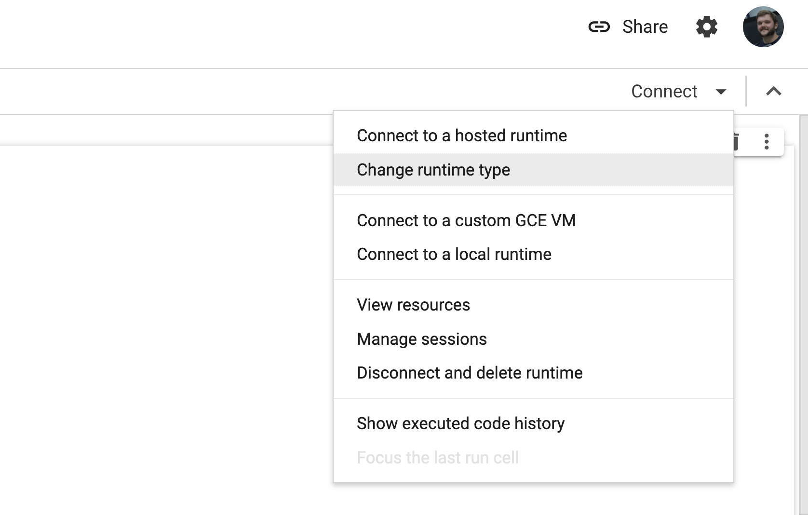

# GPU development with Python 101 Tutorial

**Welcome to the GPU Development in Python 101 tutorial.**

Since joining NVIDIA I’ve gotten to grips with the fundamentals of writing accelerated code in Python. I was amazed to discover that I didn’t need to learn C++ and I didn’t need new development tools. Writing GPU code in Python is easier today than ever, and in this tutorial, I will share what I’ve learned and how you can get started with accelerating your code.

In this tutorial we will cover:
- What is a GPU and why is it different to a CPU?
- An overview of the CUDA development model.
- Numba: A high performance compiler for Python.
- Writing your first GPU code in Python.
- Managing memory.
- Understanding what your GPU is doing with pyNVML (memory usage, utilization, etc).
- RAPIDS: A suite of GPU accelerated data science libraries.
- Working with Numpy style arrays on the GPU.
- Working with Pandas style dataframes on the GPU.
- Performing some scikit-learn style machine learning on the GPU.

Attendees will be expected to have a general knowledge of Python and programming concepts, but no GPU experience will be necessary. The key takeaway for attendees will be the knowledge that they don’t have to do much differently to get their code running on a GPU.

## Running the tutorial

This tutorial has been updated to run on [Google Colab](https://colab.google/) (as of Dec 2023) which allows anyone with a Google account to get an interactive Python environment with a GPU.

To run each notebook you need to click the link on the table below to open it in Colab, and then set the runtime to include a GPU. **You will need to do this for every notebook.**

To do this you need to:
- Select the arrow next to "Connect" in the top right
- Select "Change runtime type"
- Choose a GPU (the T4 is available in the free tier and is more than enough for this tutorial)
- Hit save

## Notebooks 

| Notebook      | Link |
| ----------- | ----------- |
| 0.0 Welcome | |
| 1.0 CPU GPU Comparison | |
| 2.0 Numba | |
| 2.1 Numba Lab | |
| 2.2 Numba Lab (solution) | .ipynb)|
| 3.0 Numba Gauss | |
| 3.1 Numba Lab 2 | |
| 3.2 Numba Lab 2 (solution) | .ipynb)|
| 4.0 pyNVML | |
| 4.1 CUDA Array Interface | |
| 5.0 Cupy | |
| 5.1 Cupy Lab | |
| 5.2 Cupy Lab (solution) | .ipynb)|
| 6.0 cuDF | |
| 7.0 cuML | |
| 8.0 Multi-GPU with Dask | |
